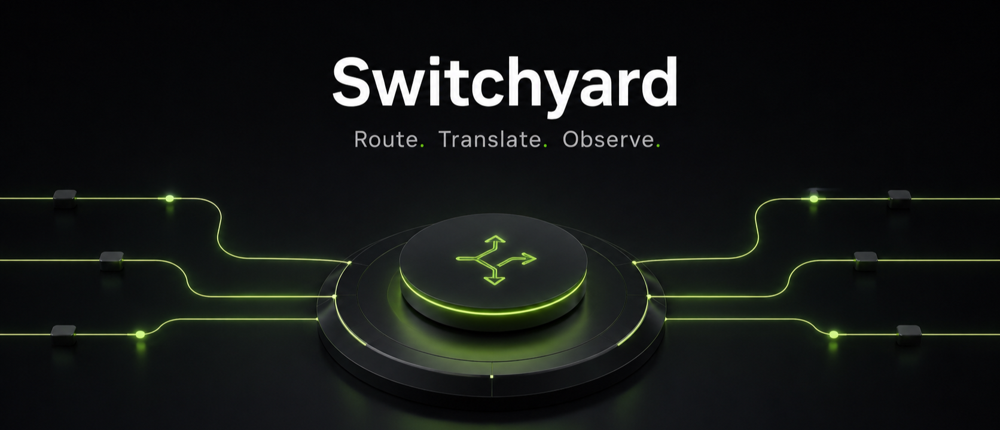

<p align="center">
  
</p>

# Switchyard

Typed, composable LLM routing and format translation for Python. Route traffic between multiple LLM providers, translate between OpenAI and Anthropic APIs, collect usage statistics, and build profile-backed routing flows with strong typing and minimal boilerplate.

**Why Switchyard?** Point coding agents like **Claude Code** and **Codex** at compatible open-source models. Switchyard transparently translates between OpenAI Chat, Anthropic Messages, and OpenAI Responses formats, so each agent keeps speaking its native API while requests are served by vLLM, NVIDIA NIM, Ollama, or any OpenAI-compatible endpoint. The same proxy can also **route across multiple models** for A/B benchmarking splits, signal-driven cascade escalation, or a custom router you wire in.

**Launcher routing is explicit**: launchers default to built-in LLM-classifier routing, which you can tune with `--weak-model`, `--classifier-model`, `--profile`, and `--classifier-min-confidence`; use `--model X` for single-model passthrough. The deprecated `--routing-profiles FILE` path remains for launcher-owned legacy bundles.

## Features

- **Protocol Translation**: convert between OpenAI Chat, Anthropic Messages, and OpenAI Responses formats
- **Multi-Backend Routing**: random routing, LLM-as-classifier routing, signal-driven cascade, or custom routers
- **Strong Types**: typed request/response containers for OpenAI, Anthropic, and Responses APIs
- **Profile-Owned Routing**: typed profiles own routing, backend calls, stats, and translation wiring
- **One-Command Launchers**: `switchyard launch claude`, `switchyard launch codex`, and `switchyard launch openclaw` spin up a local proxy and drop you into the target CLI
- **Request Statistics**: collect per-request latency, token, and cost data

## Quick Start

### Install from PyPI

```bash
pip install "switchyard[cli,server]"
```

### Install from source for local use (requires uv)

```bash
git clone git@github.com:NVIDIA-NeMo/Switchyard.git
cd switchyard
uv tool install --editable '.[server,cli]'
```

### Install from source for contributors (requires uv)

```bash
git clone git@github.com:NVIDIA-NeMo/Switchyard.git
cd switchyard
uv sync
uv run switchyard ...
```

### 1. Launch Claude Code, Codex, or OpenClaw through Switchyard

Create an OpenRouter account at [openrouter.ai](https://openrouter.ai/) and
generate an API key from the [OpenRouter keys page](https://openrouter.ai/keys),
then export it:

```bash
export OPENROUTER_API_KEY="your-openrouter-key"  # pragma: allowlist secret
export OPENROUTER_BASE_URL="https://openrouter.ai/api/v1"
switchyard launch claude --model openai/gpt-4o-mini --api-key "$OPENROUTER_API_KEY" --base-url "$OPENROUTER_BASE_URL"
switchyard launch codex --model openai/gpt-4o-mini --api-key "$OPENROUTER_API_KEY" --base-url "$OPENROUTER_BASE_URL"
switchyard launch openclaw --model openai/gpt-4o-mini --api-key "$OPENROUTER_API_KEY" --base-url "$OPENROUTER_BASE_URL"
```

Each launcher starts a local proxy, points the agent at it, and shuts the proxy
down when the agent exits. Use `--model` for single-model passthrough. The
deprecated `--routing-profiles` flag remains for launcher-owned legacy bundles:

```bash
switchyard launch claude --model openai/gpt-4o-mini --base-url https://openrouter.ai/api/v1       # single-model passthrough
switchyard --routing-profiles routes.yaml -- launch claude                                        # legacy route bundle
```

> **Bedrock-backed profile caveat (Claude Code + MCP):** Bedrock enforces a 64-character `toolSpec.name` cap. Claude Code's MCP bridge can auto-inject longer tool names, producing `BedrockException` 400s on tool-bearing requests. If you use a Bedrock-backed route and hit this, swap to an OpenAI-compatible model with `--model openai/gpt-4o` or a routing-profile YAML.

See [Agent Launchers](docs/guides/agent_launchers.md) for supported harness
versions, model requirements, troubleshooting, and Claude Code `/model` picker
aliasing.

### 2. Run a standalone profile-config server

New standalone deployments use a profile config that separates provider
connectivity, upstream targets, and client-facing profiles. A complete
OpenRouter-backed random-routing config looks like this:

```yaml
endpoints:
  openrouter:
    api_key: ${OPENROUTER_API_KEY}
    base_url: https://openrouter.ai/api/v1

targets:
  strong:
    endpoint: openrouter
    model: openai/gpt-4o
    format: openai
  weak:
    endpoint: openrouter
    model: openai/gpt-4o-mini
    format: openai

profiles:
  smart:
    type: random-routing
    strong: strong
    weak: weak
    strong_probability: 0.3
```

Serve it as a proxy. The `smart` profile and both target ids are exposed as
models; clients select one through the request's `model` field:

```bash
switchyard serve --config profiles.yaml --port 4000
curl http://localhost:4000/v1/models
curl http://localhost:4000/v1/chat/completions \
  -H "Content-Type: application/json" \
  -d '{"model": "smart", "messages": [{"role": "user", "content": "hi"}]}'
```

> **Launcher compatibility:** Launcher subcommands do not accept `--config`.
> The deprecated `--routing-profiles` flag remains for launcher-owned legacy
> `routes:` bundles and saved bundle paths:

```yaml
routes:
  fast:
    type: model
    target: openai/gpt-4o-mini
```

```bash
switchyard --routing-profiles routes.yaml -- launch claude
switchyard --routing-profiles routes.yaml -- configure
```

For profile selection and full configuration examples, start with
[Routing Overview](docs/routing_algorithms/overview.md), then open the
strategy-specific page:

- [Random Routing](docs/routing_algorithms/random_routing.md)
- [LLM Classifier Routing](docs/routing_algorithms/llm_classifier_routing.md)
- [Cascade Routing](docs/routing_algorithms/cascade_routing.md)

For multi-turn classifier sessions, see
[Session Affinity (Sticky Routing)](docs/routing_algorithms/sticky_routing.md).

### 3. Use as a Python library

```python
import asyncio

from switchyard import ChatRequest, PassthroughProfileConfig, ProfileSwitchyard

switchyard = ProfileSwitchyard(PassthroughProfileConfig(
    api_key="sk-...",
    base_url="https://api.openai.com/v1",
).build())

async def main():
    request = ChatRequest.openai_chat({
        "model": "gpt-4o",
        "messages": [{"role": "user", "content": "What is 2+2?"}],
    })
    response = await switchyard.call(request)
    # call() returns a JSON-compatible dict in the OpenAI Chat Completions shape.
    print(response["choices"][0]["message"]["content"])

asyncio.run(main())
```

## Architecture

Switchyard sits between client applications and one or more LLM backends:

```text
clients --> Switchyard --> model backends
            +--------> routing, translation, and fallback
```

Clients keep their supported OpenAI or Anthropic API format while Switchyard
selects a configured model endpoint and translates the response back to the
expected shape. See [Architecture](docs/architecture.md) for system context and
the end-to-end request flow.

## Installation Options

Install from PyPI:

```bash
pip install switchyard
```

Optional extras:

```bash
pip install "switchyard[server]"   # FastAPI / Uvicorn HTTP endpoints
pip install "switchyard[cli]"      # Interactive CLI launchers (Claude / Codex)
pip install "switchyard[all]"      # Server, CLI, GPU routing, and tracing extras
```

See [Installation](INSTALLATION.md) for a full breakdown of what each extra adds.

## Documentation

- **[Getting Started](docs/getting_started.md)**: step-by-step setup, first request, troubleshooting
- **[Known Issues](docs/known_issues.md)**: known issues in 0.1.0
- **[Agent Launchers](docs/guides/agent_launchers.md)**: Claude Code, Codex, and OpenClaw launcher behavior
- **[Cli Reference](docs/cli_reference.md)**: canonical reference for every `switchyard` subcommand and flag
- **[Architecture](docs/architecture.md)**: system context and end-to-end request flow
- **[Routing Algorithms](docs/routing_algorithms/)**: signal-driven weak/strong cascade routing: picker layers, signal dimensions, and calibration data.
- **[Contributing](CONTRIBUTING.md)**: dev setup, testing, CI gates, PR process
- **[Development](DEVELOPMENT.md)**: project structure, benchmarks, conventions
- **[Agents](AGENTS.md)**: full design philosophy and architectural patterns

## Supported Providers

- **OpenAI**: Chat Completions API
- **Anthropic**: Claude Messages API
- **OpenAI Responses API**: structured output / reasoning
- **OpenAI-compatible APIs**: vLLM, Ollama, Azure, etc. (anything with `/v1/chat/completions`)

## Requirements

- Python 3.12+
- macOS, Linux, or Windows
- API keys for your chosen backend (OpenAI, Anthropic, etc.)
- Linux x86_64 wheels require an x86-64-v3 / AVX2-class CPU (post 2013).
- Linux aarch64 wheels require a Neoverse N1-class CPU (post 2020).

## Community

- **Issues**: [GitHub Issues](https://github.com/NVIDIA-NeMo/Switchyard/issues)
- **Code of Conduct**: [Code of Conduct](CODE_OF_CONDUCT.md)
- **Contributing**: [Contributing](CONTRIBUTING.md)

## License

[Apache 2.0 License](LICENSE). Copyright NVIDIA Corporation.
